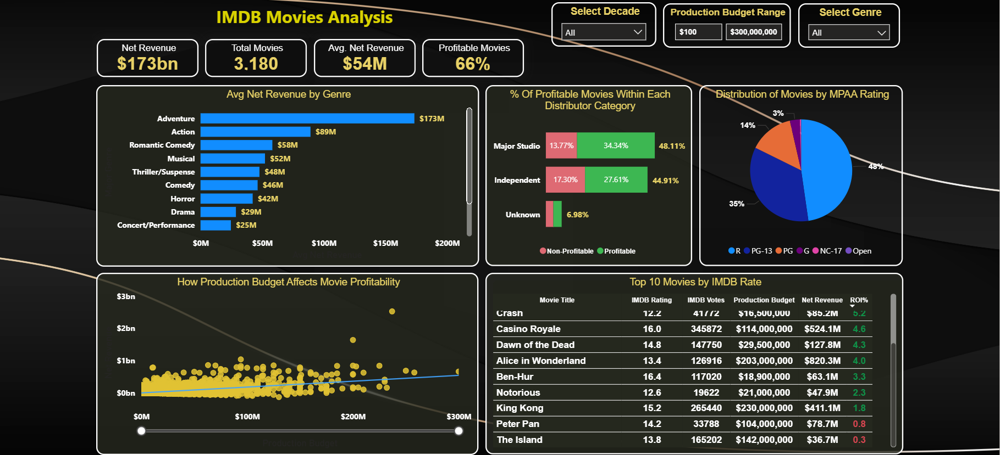

### PowerBI Project Overview

This project transforms a raw dataset of 3,100+ IMDB movie records into a comprehensive Business Intelligence ecosystem. The goal was to identify profitability drivers and analyze genre performance to provide data-driven insights for content strategy.

# Data Engineering & ETL Process
Before visualization, a rigorous ETL process was conducted to ensure data integrity:

Extraction: Imported raw data from movie industry datasets.

Transformation: * Cleaned and standardized movie titles and distributor names.

Handled missing values in budget and revenue columns to avoid skewed ROI calculations.

Engineered new columns for "Decades" and "Profitability Status" to enable deeper filtering.

Applied data type formatting for currency and numerical analysis.

Loading: Structured the data into a high-performance Star Schema model.

# Data Architecture & Modeling
The project is built on a robust relational model to ensure scalability:

 Fact Table: Fact_Movies containing core metrics like Revenue, Budget, and ROI.

Dimension Tables: Dedicated dimensions for Dim_Directors, Dim_Genres, Dim_Dates, Dim_MPAA, and Dim_Distributors.

DAX Engineering: Developed custom measures for Profitability %, ROI, and dynamic currency formatting in Billions/Millions.

# Key Business Insights
Profitability Benchmark: 66% of the analyzed movies reached profitability.

Revenue Leaders: The 'Adventure' genre emerged as the highest average net revenue driver at $173M.

Risk Analysis: Visualized the correlation between production budgets and net revenue to identify high-risk investment categories.

# Technical Stack
Power BI: Data visualization and report hosting.

Power Query (M): Used for the ETL and data transformation layers.

DAX: For complex business logic and advanced statistical measures.
